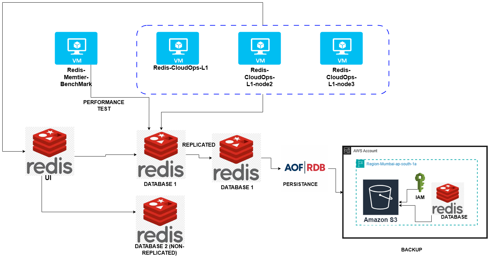

Redis Enterprise: Multi-Node HA Cluster Deployment with Persistence, Failover & Performance Benchmarking

Project Overview

This project demonstrates the complete deployment and operational management of a three-node Redis Enterprise cluster with:

High Availability (HA)

Replication

AOF/RDB persistence

AWS S3 backups

Performance benchmarking

Data recovery validation

All tasks were executed on Ubuntu 22.04 LTS VMs running inside Oracle VirtualBox, following Redis Enterprise best practices.

Table of Contents

Architecture Diagram

Environment Setup

Installing Redis Enterprise

Cluster Creation

Database Configuration

Backup Configuration

Benchmarking

Adding Test Data

Resilience Test

Data Recovery

Conclusion

Repository Structure

 Architecture Diagram

## 1. Environment Setup

A three-node Redis Enterprise cluster was deployed using Oracle VirtualBox, each running Ubuntu 22.04 LTS.

Virtual Machines
VM Name	Purpose
Redis-CloudOps-L1	Node 1 (Cluster Initiator)
Redis-CloudOps-L1-node2	Node 2
Redis-CloudOps-L1-node3	Node 3

Each VM included:

Proper network configuration

Static IP assignment

System dependencies

SSH access

All machines were prepared to ensure stable inter-node communication.

## 2. Installing Redis Enterprise Software

Downloaded from Redis Enterprise Download Center:

GPG-KEY-redislabs-packages.gpg

redislabs-8.0.2-17-jammy-amd64 installation binary

Files were transferred using WinSCP.

Installation Process
gpg --import GPG-KEY-redislabs-packages.gpg
sudo chmod +x install.sh
sudo ./install.sh

DNS Fix for Installer

Redis Enterprise requires systemd DNS override:

sudo vi /etc/systemd/resolved.conf     # Set DNSStubListener=no
sudo mv /etc/resolv.conf /etc/resolv.conf.orig
sudo ln -s /run/systemd/resolve/resolv.conf /etc/resolv.conf
sudo service systemd-resolved restart
sudo ./install.sh

UI Access

Redis Enterprise Management UI:

https://<node-ip>:8443

## 3. Cluster Creation

Cluster was initialized from Node 1 using UI.

Cluster Settings

Public Endpoints: Enabled

Rack/Zone Awareness: Enabled

Cluster Domain: rediscluster.enterprise.com

Flash Storage: Enabled

Rack-Zone IDs:

Node 1 → Redis-Rack1

Node 2 → Redis-Rack2

Node 3 → Redis-Rack3

Nodes 2 and 3 joined using:

Node 1 IP

Admin credentials

Flash settings

Individual rack-zone IDs

Successfully formed a multi-node Redis Enterprise cluster.

## 4. Database Configuration

Two databases were created to demonstrate replication behavior.

Database 1 – Replication Enabled

Name: Redis-Database1

Version: 8.2.1

Replication: ON (High Availability)

Database 2 – Replication Disabled

Name: Redis-Database2

Version: 8.2.1

Replication: OFF (Single node)

This comparison shows how Redis Enterprise handles failover vs no failover.

## 5. Backup Configuration (AOF & RDB)

Both persistence types and S3 backups were enabled.

AOF – Append Only File

Frequency: Every 1 second

Persistence Type: AOF

Target: AWS S3

RDB – Snapshot

Frequency: Every 1 hour

Target: AWS S3

AWS Setup

Bucket: redis-databasebackup

IAM User: redis-backup-user

Custom S3 access policy

Access key + secret key added to Redis UI

✔ AOF & RDB backups successfully uploaded to S3.

## 6. Benchmarking

A separate VM was created for benchmarking using memtier_benchmark.

Benchmark Command
/opt/redislabs/bin/memtier_benchmark -s <DB_HOST> -p <DB_PORT> -t 4 -R --ratio=1:1

The test measured:

Read/Write throughput

Operations per second

Latency under load

Cluster performance

## 7. Adding Test Data

Installed Redis CLI on the testing VM.

Connect to DB
redis-cli -h <ipaddress> -p 18265

Insert Data
SET emp:1 "Sefali"
SET emp:2 "Sharon"
SET emp:3 "Sabnam"

Verify
KEYS emp:*
GET emp:1
GET emp:2
GET emp:3

 Verified via CLI and Redis Enterprise UI.

## 8. Resilience Test

A resilience test was performed by restarting the master node.

Outcome
Database	Result
Replicated	Automatic failover → No downtime
Non-Replicated	Database unavailable → No failover

 Verified cluster’s High Availability (HA) and automatic failover.

## 9. Data Recovery

Performed using Redis Enterprise UI → Database → Export/Import.

Tested:

AOF-based recovery

RDB snapshot recovery

 Data restored successfully from S3 backups.

## Conclusion

This project demonstrates:

Complete Redis Enterprise 3-node HA cluster deployment

Replication vs non-replication with real failover tests

AOF/RDB persistence configuration

AWS S3 backup integration

Performance benchmarking with memtier_benchmark

Hands-on data recovery and resilience validation

Proper CloudOps L1 operational understanding

All components were implemented inside a VirtualBox-based private environment.